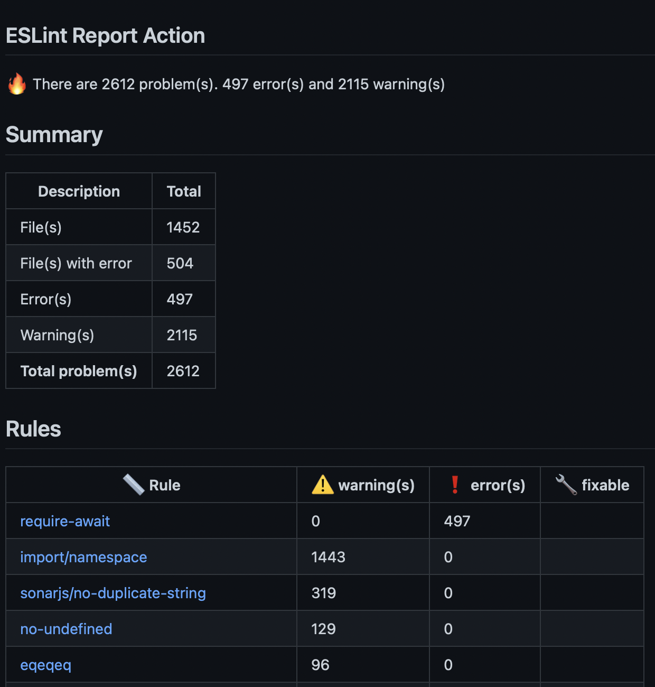
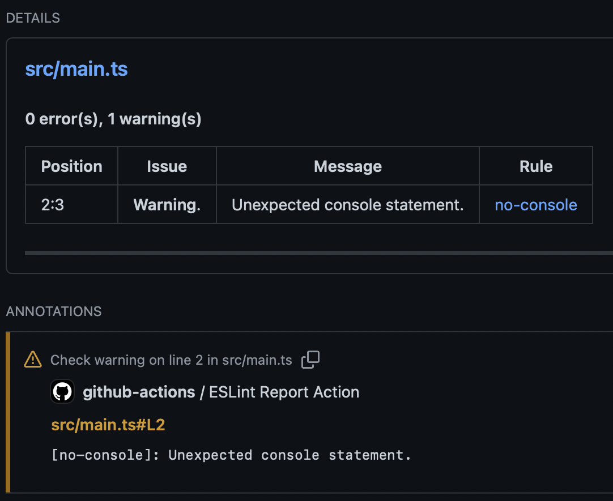

# ESLint Report Action

Create a summary with the generated ESLint JSON report.

### Summary



### Annotations


## Inputs

### `token`

**Required** Default is `${{ github.token }}`

### `report`

**Required** The path to the ESLint report JSON file

### `title`

_Optional_. the Summary title

### `view-rules`

_Optional_. Enables the display of errors or warnings by rules. Default is `true`

### `fail-on-warning`

_Optional_. Fail when ESLint warnings are detected. Default is `false`

### `total-problems`

_Optional_. Github has the limitation that you can only have 50 annotations and 65535 characters per request. This input tries to solve the problem, limiting the number of visible problems. Default is `100`

## Example usage

In [.github/workflows/main.yml](.github/workflows/main.yml)

```yaml
name: Main flow

on:
  push:
    branches:
      - main

jobs:
  lint:
    runs-on: ubuntu-latest
    steps:
      - uses: actions/checkout@v3
      - uses: actions/setup-node@v3
        with:
          node-version: 16
      - run: npm ci
      - run: npm run lint:json
        continue-on-error: true
      - uses: ldiego73/eslint-report@v1
        with:
          token: ${{ secrets.GITHUB_TOKEN }}
          report: reports/lint.json
```
